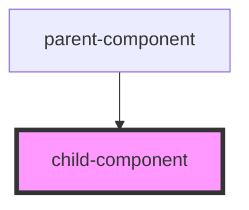

# child-component

<!-- Auto Generated Below -->

## Properties

| Property       | Attribute       | Description | Type     | Default     |
| -------------- | --------------- | ----------- | -------- | ----------- |
| `childMessage` | `child-message` |             | `string` | `undefined` |

## Dependencies

### Used by

 - [parent-component](../parent-component)

### Graph

----------------------------------------------

*Built with [StencilJS](https://stenciljs.com/)*
